# Comparing Revisions — Feature Specification

**Source:** MR 33999 ([CCR-149]) | **Author:** Aida Osseyran | **Team:** CCR  
**Spec file:** `modeler/Mendix.Modeler.VersionControl.View/DesignSpecs/Comparing revisions/ComparingRevisions.md`  
**Status:** Phase 1 in scope; Phase 2/3 deferred (see [open-questions.md](../open-questions.md))

> **Implementation audit (2026-04-03):** Sections marked `⚠️ NOT IMPLEMENTED` or `⚠️ PARTIAL` reflect features not yet built in the codebase (audited against `ide-client/core/version-control/comparison-pane` and `Mendix.Modeler.VersionControl.View/Comparison`). **Skip these sections when writing user documentation.**

---

## Overview

The Comparing Revisions feature introduces a new **Comparison Pane** in Studio Pro that lets users compare the contents of two revisions of their version-controlled app. Users can see which documents differ, what elements changed within each document, and what specific property values changed.

This feature requires a version-controlled app. Unversioned apps will see a disabled state.

---

## Entry Points

> **⚠️ PARTIAL — document only the implemented entry point below.**
>
> Only **History Pane → right-click → Compare to current state** is implemented. All other entry points listed in the spec are not built.

There are five ways to start a revision comparison:

| Entry Point | How | Implemented? |
|---|---|---|
| History Pane → button | Select a revision → click **Compare revision** button | ⚠️ No |
| History Pane → right-click | Right-click a revision → choose: *Compare to previous*, *Compare to parent*, **Compare to current state**, or *Compare to…* | ⚠️ **Compare to current state only** |
| MxDock menu | Version Control → **Compare Revisions…** | ⚠️ No |
| Comparison Pane | Click **Select revisions** button in the task bar | ⚠️ No (Select Revisions dialog not built) |
| Comparison alert | Click **Select revisions** in the alert banner | ⚠️ No (alert banner not built) |

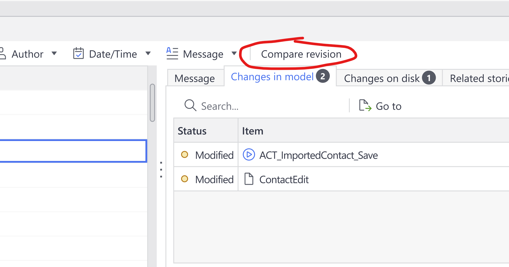
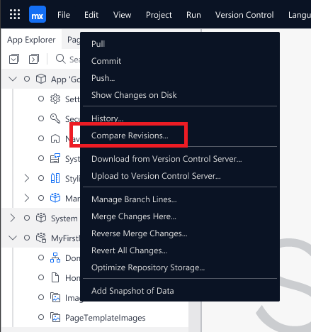

> A custom icon for the menu item has been requested (Jira: MXICONS).

---

## Selecting Revisions Dialog

> **⚠️ NOT IMPLEMENTED — skip this entire section in documentation.** No Select Revisions dialog exists in the frontend. Comparison is initiated solely via the History Pane right-click context menu ("Compare to current state").

The Select Revisions dialog is opened from any of the entry points above. It lets the user choose which two revisions to compare.

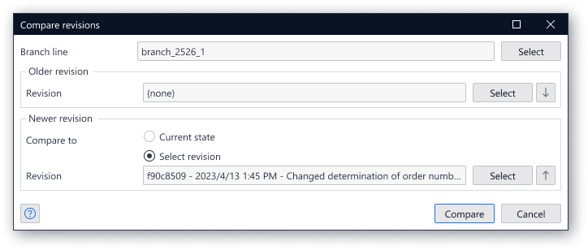

### Fields

- **Branch line** — the branch to compare on. Click **Select** to open the Branch Line selector popup.
- **Older revision** — the earlier of the two revisions. Click **Select** to open the Revision selector.
- **Newer revision** — the later revision. Can also be set to *Current revision + uncommitted changes*.

### Pre-filling behavior

| Entry point | Older revision | Branch line | Newer revision |
|---|---|---|---|
| From History | Set to the selected revision | Set to that revision's branch | Current revision + uncommitted changes |
| From MxDock / Select revisions (no active comparison) | (none) | Current working branch | Current revision + uncommitted changes |
| From MxDock / Select revisions (comparison active) | Current comparison settings shown | — | — |

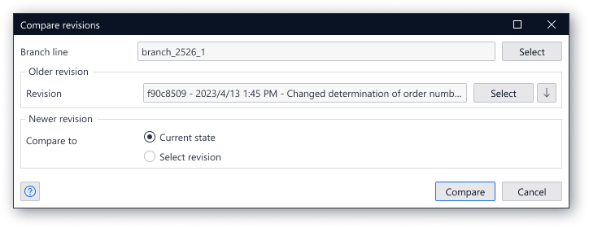
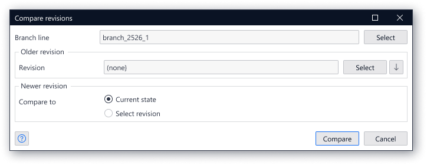

### Branch Line Selector

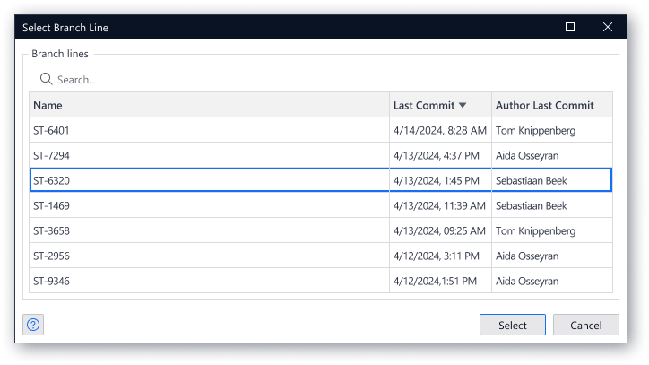

- Searchable by Name and Author Last Commit columns
- Column headers are sortable (ascending/descending)
- Date/time shown in local notation
- Author shown as full name; tooltip on hover: `Firstname Lastname <email@address.com>`
- Tooltip on hover for Name and Last Commit cells showing full content
- After selecting a different branch, both revisions reset to (none)

### Revision Selector

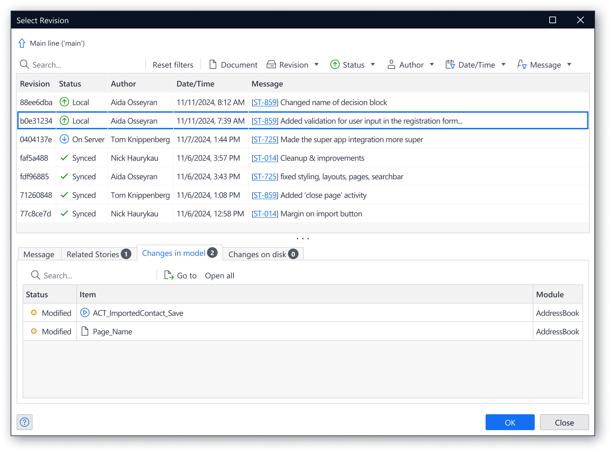

Reuses the existing Select Revision dialog.

- When selecting **Older**: revisions newer than the current Newer revision are disabled
- When selecting **Newer**: revisions older than the current Older revision are disabled

### Arrow (Swap) Buttons

The arrow button next to each **Select** button swaps the revision to the other side:
- Arrow in Older area → Older revision moves to Newer; Older resets to none
- Arrow in Newer area → Newer revision moves to Older; Newer resets to none

### Starting the Comparison

Click **Compare** to start. The Comparison Pane opens (or comes into focus).

---

## Comparison Alert Banner

> **⚠️ NOT IMPLEMENTED — skip this entire section in documentation.** No alert banner component exists anywhere in the codebase.

Once a comparison is active, an alert banner appears at the top of the IDE, directly below the MxDock.

**Format:**  
`Comparing 'Older' revision: <local date/time> - <hash> to 'Newer' revision: <local date/time> - <hash>`

**If Newer is "Current revision + uncommitted changes"**, append:  
`+ uncommitted changes`

Example:  
`Comparing 'Older' revision: 2023/4/13 1:45 PM - f90c8509 to 'Newer' revision: 2023/4/21 11:28 AM - 8e9c2792`

> Research is ongoing on the exact location of the alert (under MxDock, top of diffed document, or top of comparison pane).

---

## Comparison Pane

The Comparison Pane is a new dockable pane.

- **On first open:** shown in the bottom pane
- **If previously closed:** reopens in its last-used location
- **If already open:** brought into focus

The **tab badge** shows the count of documents that differ between the two revisions. ⚠️ NOT IMPLEMENTED — tab badge does not exist in the current implementation.

### Unversioned App State

If the app is not version controlled, all buttons are disabled, the badge disappears, and a message is shown.

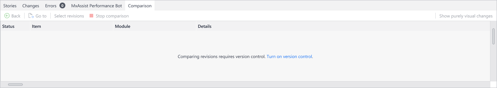

### Loading State

A spinner is shown during operations likely to take more than 2 seconds (e.g. starting a comparison).

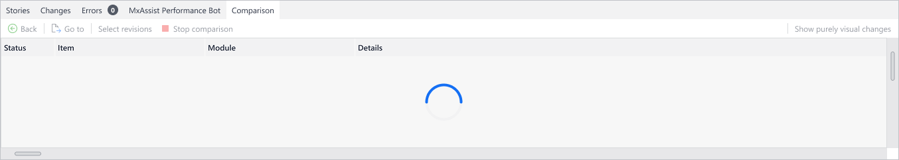

---

## Level 1 — Document List

Level 1 shows all documents that differ between the two selected revisions.

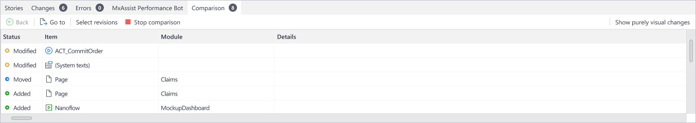

### Task Bar

| Button | Behavior |
|---|---|
| **Back** | Always disabled at Level 1 (kept to prevent layout shift) |
| **Go to** | Opens the selected document; navigates to Level 2/3. Same as double-clicking a row. |
| **Select revisions** | Opens the Select Revisions dialog | ⚠️ NOT IMPLEMENTED (dialog not built) |
| **Stop comparison** | Stops the comparison (see below) | Implemented |
| **Show purely visual changes** toggle | When active, documents with only visual changes are shown; when inactive, they are hidden | ⚠️ NOT IMPLEMENTED (analytics event only; no UI control) |

**Go to — deleted document behavior (Phase 1):**
- If document exists in current version → open it
- If document does not exist → button disabled; tooltip: *"This document doesn't exist in your local project."*

**Go to — module change:**
- Focus on the module in App Explorer if possible
- If module not in current project → button disabled; same tooltip

**Go to — project-level change:** Focus on the project node in App Explorer.

**Stop comparison:**
- All open documents showing split-screen comparison are closed
- Alert banner disappears
- Comparison Pane returns to blank/no-comparison state

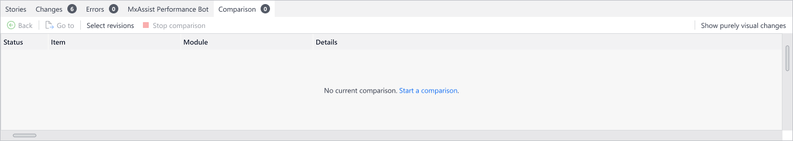

In the blank state:
- The hyperlink text acts as the **Select revisions** button
- **Go to** and **Stop comparison** buttons are deactivated

### Grid

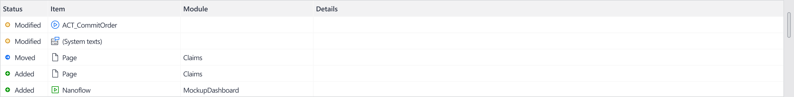

| Column | Description |
|---|---|
| Status | Icon + label indicating type of change (added / modified / deleted) |
| Item | Document name |
| Module | Module the document belongs to |

- Column widths are adjustable
- Column headers are sortable (ascending/descending)
- Full cell value shown in tooltip on hover
- Right-click on any cell → **Copy**
- Icon and text spacing consistent with History Pane commit details

---

## Level 2 and 3 — Element and Property Diffs

Double-clicking a document at Level 1 navigates to Level 2/3.

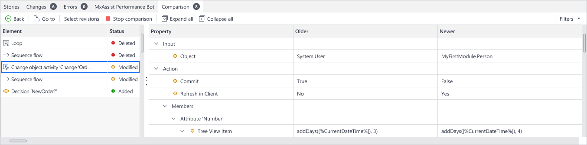

### Task Bar (Level 2/3)

| Button | Behavior |
|---|---|
| **Back** | Navigate back to Level 1 |
| **Go to** | Focus on the selected Level 2 element in the document; display its changed properties in Level 3. Active even for deleted elements (for cross-tab navigation). |
| **Select revisions** | Same as Level 1 | ⚠️ NOT IMPLEMENTED |
| **Stop comparison** | Same as Level 1 | Implemented |
| **Expand all** | Expands all grey (path) rows in Level 3 | Implemented |
| **Collapse all** | Collapses all grey (path) rows in Level 3 | Implemented |
| **Show purely visual changes** toggle | When active, shows visual-only changes in Level 2; when inactive, hides them | ⚠️ NOT IMPLEMENTED |

### Level 2 Grid

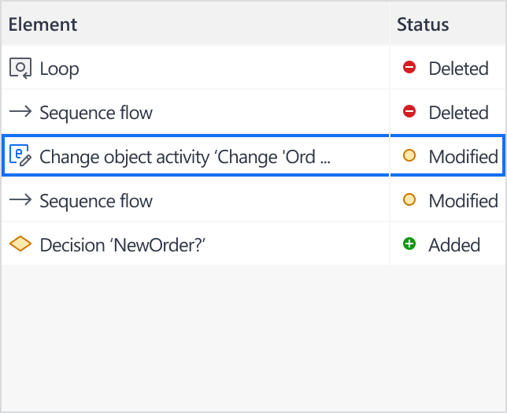

Shows all changed elements of the selected document (except visual-only changes if toggle is off).

| Column | Description |
|---|---|
| Status | Icon + label (added / modified / deleted) |
| Item | Element name |

- Full cell value shown in tooltip on hover
- Icon and text spacing consistent with History Pane

### Level 3 Grid

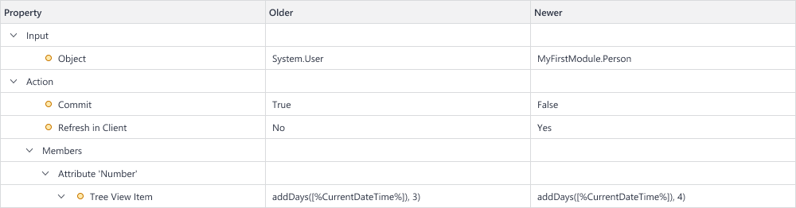

Shows the property-level diff for the element selected in Level 2.

| Column | Description |
|---|---|
| Property | Property name, shown as a tree (grey rows = path nodes without a direct value) |
| Older | Value in the Older revision |
| Newer | Value in the Newer revision |

- Property paths are consolidated into a tree view
- Grey rows = intermediate path levels (no direct value)
- Row order reflects top-to-bottom, left-to-right order of corresponding UI components in their dialogs

### Splitter

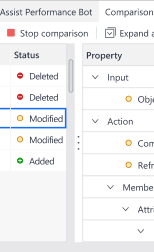

A draggable splitter separates Level 2 and Level 3.  
No padding between the splitter and adjacent elements.  
By default, more space is given to Level 3 than Level 2 (not a 50/50 split).

---

## Refresh Behavior

> **⚠️ PARTIAL — document only the Refresh button row.** Live refresh (automatic update on save or new commit) was dropped per MR review. The Refresh button (manual) is implemented. Skip the automatic-update rows.

| Newer revision setting | Trigger | Behavior | Implemented? |
|---|---|---|---|
| Current state | User saves changes | Activate **Refresh** button; clicking it updates the comparison | Implemented |
| Current state | New commit made | Automatically update comparison to include new commit | ⚠️ Dropped (see open-questions.md) |
| HEAD (latest commit) | New commit made | Keep comparison unchanged; update labels if needed | ⚠️ Not confirmed |
| Any other revision | New commit made | No change | ⚠️ Not confirmed |

---

## Opening Documents from the Comparison Pane

When **Go to** or double-click is used on a document entry:

### Phase 1 (current)
- The document is opened as it currently exists in the project
- If the document no longer exists, Level 2/3 is shown but nothing is opened in the editor

### Phase 2 (future)
- Both versions of the document are opened side-by-side
- Each version has blue tab text indicating Older/Newer revision
- On open, the Older version is to the left

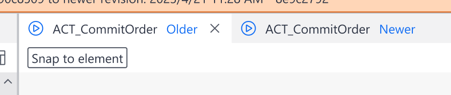

### Phase 3 (future)
- Visual diffing — exact design TBD

---

## New UI Elements Summary

| Element | Type |
|---|---|
| Comparison Pane | New dockable pane |
| Comparison Alert Banner | New status bar below MxDock |
| Select Revisions dialog | New dialog |
| Branch Line selector popup | New popup (searchable table) |
| "Compare Revisions…" in MxDock → Version Control | New menu item |
| "Compare revision" button in History Pane | New toolbar button |
| Right-click context menu in History grid | New: Compare to previous / parent / current state / … |

---

## Related

- Jira: CCR-149
- Custom icon request: https://mendix.atlassian.net/wiki/spaces/MXICONS/pages/3741155509
- History Pane spec: [../history-pane/feature-spec.md](../history-pane/feature-spec.md)
- Open questions: [../open-questions.md](../open-questions.md)
